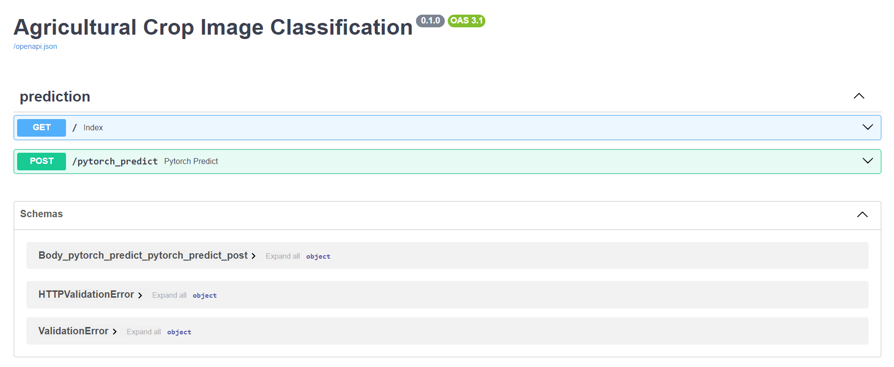

# Agricultural Crop Image Classification with Deep Learning

This project demonstrates an API for image classification of agricultural crops using a dataset of agricultural crop images. We compare the performance of various deep learning models trained with PyTorch, including a custom Convolutional Neural Network (CNN) and transfer learning with pre-trained models like VGG16, ResNet50, EfficientNetV2, and GoogleNet. The API is built using FastAPI, a framework for building high-performance APIs.

## Comparison of Model Performance

Here, we present the overall accuracy achieved by each model.

1. Overall accuracy

As you can see, transfer learning with VGG16 achieved the highest overall accuracy.

2. Train loss

3. Valid loss

## FastAPI for Image Classification

The API provides a POST endpoint for image classification using PyTorch.

## Images test

